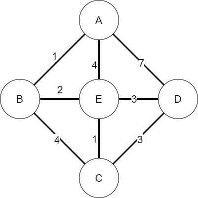
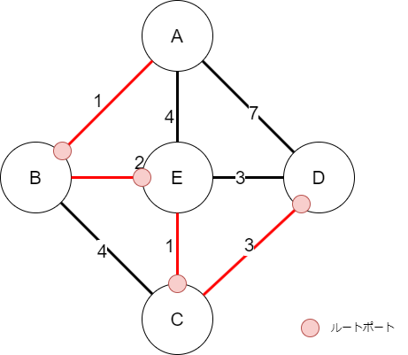
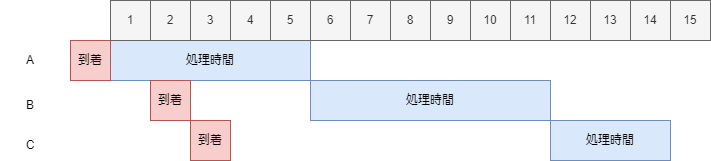

# 2024 午前2

## 問1 x

> BGP-4におけるASに関する記述として、適切なものはどれか。

ウ : 同一の管理ポリシーによって管理されるネットワーク群であり、2オクテット又は4オクテットのAS番号によって識別される。

[https://www.nic.ad.jp/ja/newsletter/No35/0800.html](https://www.nic.ad.jp/ja/newsletter/No35/0800.html)

## 問2

> CS-ACELP(G.729)による 8kビット/秒の音声符号化を行うVoIPゲートウェイ装置において、パケットを生成する周期が20ミリ秒のとき、1パケットに含まれる音声ペイロードは何バイトか。

ア : 20

1s / 20ms/packet = 50 packet/s
8k bit/s = 1k byte/s
1k byte/s / 50 packet/s = 20 byte

## 問3

> 一時間あたりの平均通話回数が60で、平均保留時間は120秒である。呼損率を0.1にしたいとき、必要な回線数は最低幾らか。ここで、表中の数値は加わる呼量（アーラン）を示す。
>
> 即時式完全群負荷表
>
> | 回線数\呼損率 | 0.1 |
> |:-----------:|:------------:|
> | 3 | 1.271 |
> | 4 | 2.045 |
> | 5 | 2.881 |
> | 6 | 3.758 |

イ : 4

呼量の定義

```math
(呼量) = \frac{(呼数) * (平均回線保留時間)}{(時間)}
```

60回 平均保留時間 120s であるから、

```math
(呼量) = \frac{ 60 * 120sec }{ 1 hour }
= \frac{ 60 * 120sec }{ 60 * 60 sec }
= 2
```

表から、呼損率 0.1 で、呼量が2を超える回線数は、4以上。

## 問4

> 二つのルーティングプロトコル RTP-2 と OSPF とを比較したとき、OSPFだけに当てはまる特徴はどれか。

イ : リンク状態のデータベースを使用している。

[https://qiita.com/y-nao17/items/46def30008ccf8de6060](https://qiita.com/y-nao17/items/46def30008ccf8de6060)

OSPF : OSPFはリンクステート型のルーティングプロトコルで、ネットワーク内の全ルーターがネットワークの全体像を保持し、最短経路を計算します。
RIP : RIPは、ディスタンスベクター型のルーティングプロトコルで、最もシンプルなルーティング方式の1つです。ルーター間でホップ数を基準に経路を選択します。

## 問5

> 5個のノードA～Eから構成される図のネットワークにおいて、Aをルートノードとするスパニングツリーを構築した。このとき、スパニングツリー上で隣接するノードはどれか。ここで、図中の数値は対応する区間のコストをあらわるものとする。
> 

エ : DとE

ルートノードAからコストの低い経路を辿る。すると、経路は以下の通り。



このルートにある選択肢を選べばよい。

## 問6

> IPv4におけるARPのMACアドレス解決機能をIPv6で実現するプロトコルはどれか。

イ : ICMPv6

IPv4のARPがICMPなので、それからも容易に想像できる。

## 問7

> IPv4のIPマルチキャストアドレスに関する記述として、適切なものはどれか？

エ : IPマルチキャストアドレスの先頭の4bitを除いた残りの28bitは、受信するホストのグループを識別するために利用される。

マルチキャストアドレスは、クラスDアドレス（224.0.0.0 ～ 239.255.255.255）を使用する。このマルチキャストアドレスは宛先アドレスとしてのみ使用され、送信元アドレスはユニキャストアドレスを使用。

## 問8

> リモートアクセス環境において、認証情報やアカウンティング情報をやり取りするプロトコルはどれか。

エ : RADIUS

LDAPみたいなもの。

## 問9

> ホストAからホストBにTCPを用いてデータを送信するとき、TCPセグメントをシーケンス番号と受信確認番号（肯定応答番号）に関する記述のうち、適切なものはどれか。

ア : AがBからの応答を待たずに、続けて送信する場合のシーケンス番号は、直前に送信したTCPセグメントのシーケンス番号と送信データのオクテット数の和である。

[https://hirotanoblog.com/tcp-sequence/2044/](https://hirotanoblog.com/tcp-sequence/2044/)

## 問10

> インターネットプロトコルのTCPとUDP両方のヘッダーに存在するものはどれか。

エ : 送信元ポート番号

宛先IPアドレス : IPレイヤー
宛先MACアドレス : ICMPレイヤー
生存時間(TTL) : IPレイヤー

[https://www.isc.meiji.ac.jp/~mizutani/ict/tcp_ip.pdf](https://www.isc.meiji.ac.jp/~mizutani/ict/tcp_ip.pdf)

## 問11

> IPv4ネットワークで使用されるIPアドレスaとサブネットマスクmからホストアドレスを求める式はどれか。

ウ : a & ~m

例) 192.168.0.1/255.255.255.0 の場合、0.0.0.1がホストアドレスとなる。
つまり、 192.168.0.1 & ~(255.255.255.0) = 192.168.0.1 & 0.0.0.255 = 0.0.0.1

## 問12

> IPv4ネットワークにおいて、サブネットマスクが255.255.255.0である四つのネットワーク 192.168.32.0, 192.168.33.0, 192.168.34.0, 192.168.35.0を、CIDRを使って最小のすーぱねっとにしたときの、ネットワークアドレスとサブネットマスクの組み合わせとして、適切なものはどれか。

イ : 192.168.32.0/255.255.252.0

第3オクテットのネットワークの最大と最小
32 = 00100000(2)
33 = 00100001(2)
34 = 00100010(2)
35 = 00100011(2)

回答の・・・
第3オクテットのネットワークアドレス : 32 = 00010000(2)
第3オクテットのサブネットマスク : 11111100(2) = 255 - 3 = 252

## 問13

> ネットワークを構成するホストのIPアドレスとして用いることができるものはどれか。

イ : 176.16.10.255

アは、loopbackなのでNG。
ウは、ブロードキャストアドレスなのでNG。
エは、マルチキャストアドレスなのでNG。

## 問14

> OSPFとRIPのIPv6対応に関する記述のうち、適切なものはどれか。

イ : OSPFはバージョン3で対応している。

RIPは、RIPngからサポート。 RIPv1/v2は、IPv4 only。
[https://www.apresia.jp/products/ent/np/usersguide/layer3/top.html?p=NP_rip0_c_fc.html](https://www.apresia.jp/products/ent/np/usersguide/layer3/top.html?p=NP_rip0_c_fc.html)

OSPFは、v3で IPv6に拡張された。
[https://www.infraexpert.com/study/ipv6z16.html](https://www.infraexpert.com/study/ipv6z16.html)

## 問15

> IP電話の音声品質を表す指標のうち、ノイズ、エコー、遅延などから算出されるものはどれか。

イ : R値

R値 : 通信品質を客観評価する代表的な方法。ノイズ、エコー、遅延などの指標から、品質を100点満点で評価する。
MOS値 : 通信品質を主観評価する代表的な方法。人が聞いて、品質を五段階で評価する。
ジッタ : アナログ通信が伝送中に歪み、デジタル変換するタイミングにずれが生じること。
パケット損失率 : パケットが損失した割合

## 問16

> Webコンテンツを提供する際に CDNを利用することによって、副次的に影響を提言できる脅威はどれか。

ア : DDoS攻撃

CDNとは・・・
[https://www.kagoya.jp/howto/it-glossary/web/cdn/](https://www.kagoya.jp/howto/it-glossary/web/cdn/)

## 問17

> RLO(Right-to-Left Override)を利用した手口はどれか。

エ : 文字の表示順を変える制御文字を利用して、ファイル名の拡張子を偽装する。

[https://www.lrm.jp/security_magazine/rlo_attack/](https://www.lrm.jp/security_magazine/rlo_attack/)

## 問18

> 暗号化装置における暗号化処理時の消費電力を測定するなどして、当該装置内部の秘密情報を推定する攻撃はどれか。

イ : サイドチャネル攻撃

サイドチャネルとは、間接的な経路を利用するという意味。
それから想像すれば、答えられると思われる。

## 問19

> なりすましメール対策に関する記述のうち、適切なものはどれか。

エ : SPFでは、ドメインのDNSで、そのドメインを送信元とする電子メールの送信に用いてもよいメールサーバのIPアドレスをSPFレコードにあらかじめ記述しておく。

ウについては、「秘密鍵を受け渡す」必要があり、その時点で選択肢の説明がおかしい。
イのIP25Bは、なりすましメールを防ぐことはできない。
アのDMARCは、「該当メールを送り返す」ということはしない。

## 問20

> マルウェアの検出手法であるピヘイピア法を説明したものはどれか。

エ : マルウェアへの感染によって生じるデータの読み込み動作、書き込み動作、通信などを監視して、マルウェアを検出する。

[https://jitera.com/ja/insights/44175](https://jitera.com/ja/insights/44175)

## 問21

> IPSecに関する記述のうち、適切なものはどれか。

ア : ESPのトンネルモードを使用すると、暗号化通信の区間において、エンドツーエンドの通信で用いる元のIPヘッダーを含めて暗号化できる。

イは、ポート番号が異なる。 IKEは、 udp:500が利用される。
ウは、sha1がそもそも暗号化アルゴリズムではない。
エは、AHヘッダがアルゴリズムを決める目的ではない。

## 問22 x

> PCI Express 3.0, PCI Express 4.0 及び PCI Express 5.0を比較した記述のうち、適切なものはどれか。

ア : 1レーンの片方向最大転送レートは、PCI Express 4.0は PCI Express 3.0の二倍、PCI Express 5.0は PCI Express 4.0の二倍である。

PCI Express の各リビジョンにおける、1レーン分のデータ・レートは以下。

- PCI Express 1.0 (Gen 1) 2.5Gbits/s
- PCI Express 2.0 (Gen 2) 5Gbits/s
- PCI Express 3.0 (Gen 3) 8Gbits/s
- PCI Express 4.0 (Gen 4) 16Gbits/s

## 問23

> ジョブの多重度が1で、到着順にジョブが実行されるシステムにおいて、表に示すジョブA～Cを処理するとき、ジョブCが到着してから実行が終了するまでのターンアラウンドタイムは何秒か。ここで、OSのオーバーヘッドは考慮しない。
>
> | ジョブ | 到着時刻(sec) | 処理時間(sec) |
> |:-----------:|:------------:|:------------:|
> | A | 0 | 5 |
> | B | 2 | 6 |
> | C | 3 | 3 |

ア : 11



14(sec) - 3(sec) = 11(sec)

## 問24

> 安全性と信頼性について、次の方針でプログラム設計を行う場合、その方針を表す用語はどれか。
>
> [方針]
> 不特定多数の人が使用するプログラムには、自分だけが使用するプログラムに比べて、より多くの、データチェックの機能を組み込む。プログラムが処理できるデータの前提条件を文章で書いておくだけでなく、プログラムについては前提条件を満たしていないデータが入力されたときは、エラーメッセージを表示して再入力を促すものとする。

ア : フールプルーフ

ヒューマンエラーに対するテストは、「無知の証明」の「フールプルーフ」。

## 問25

> バグトラッキングシステムの説明として、最も適切なものはどれか。

エ : 発見されたバグの内容、バグが発生したソフトウェアのバージョンなどを記録し、その修正計画や修正履歴を管理する。

アは、デバッガの説明。
イは、コードチェッカみたいなもの？を説明している模様。
ウは、品質管理や不良曲線の説明か？。バグトラッキングシステムでも、このような機能を備えているものがあるので、注意。
